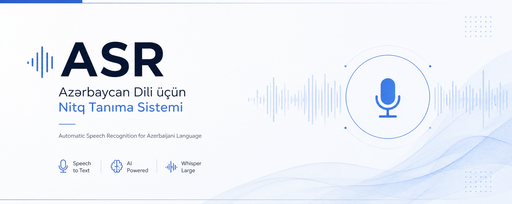

# Speech Recognition System (ASR) for the Azerbaijani Language

<p align="center">
  
</p>

This project was developed as part of the **R.I.S.K. Company AI Engineer Intern** assignment. The goal of the project is to build and optimize an Automatic Speech Recognition (ASR) pipeline for the Azerbaijani language using the Mozilla Common Voice dataset.

## Project Structure

- **part_a**: Baseline ASR implementation. Performance of the model in its initial state.
- **part_b**: Improved system (prompting and text cleaning/normalization).
- **results**: Metrics (WER/CER), results, and visualizations.
- **report.pdf**: Analytical report (Part C).
- **requirements.txt**: Required libraries and dependencies.

## Technologies and Model

- **Model:** OpenAI Whisper `large-v2`
- **Dataset:** Mozilla Common Voice 17.0 (Azerbaijani)
- **Metrics:** Word Error Rate (WER) and Character Error Rate (CER)
- **Libraries:** `openai-whisper`, `jiwer`, `pandas`, `matplotlib`

## Results Comparison

| Metric | Part A (Baseline) | Part B (Improved) | Difference |
|----------|------------------|-------------------|------------|
| **Average WER** | 32.71% | 31.28% | **-1.43%** |
| **Average CER** | 8.73% | 8.31% | **-0.42%** |

**The improvement in Part B was achieved through inference-time optimization techniques, including the use of `initial_prompt` and text normalization.**

## Installation and Usage

### 1. Install Dependencies

```bash
pip install -r requirements.txt
```

### 2. Run the Baseline Model (Part A)

```bash
python part_a/run_inference.py
python part_a/evaluate.py
```

### 3. Run the Improved Pipeline (Part B)

```bash
python part_b/train.py
python part_b/run_ft_inference.py
python part_b/plot_metrics.py
```
